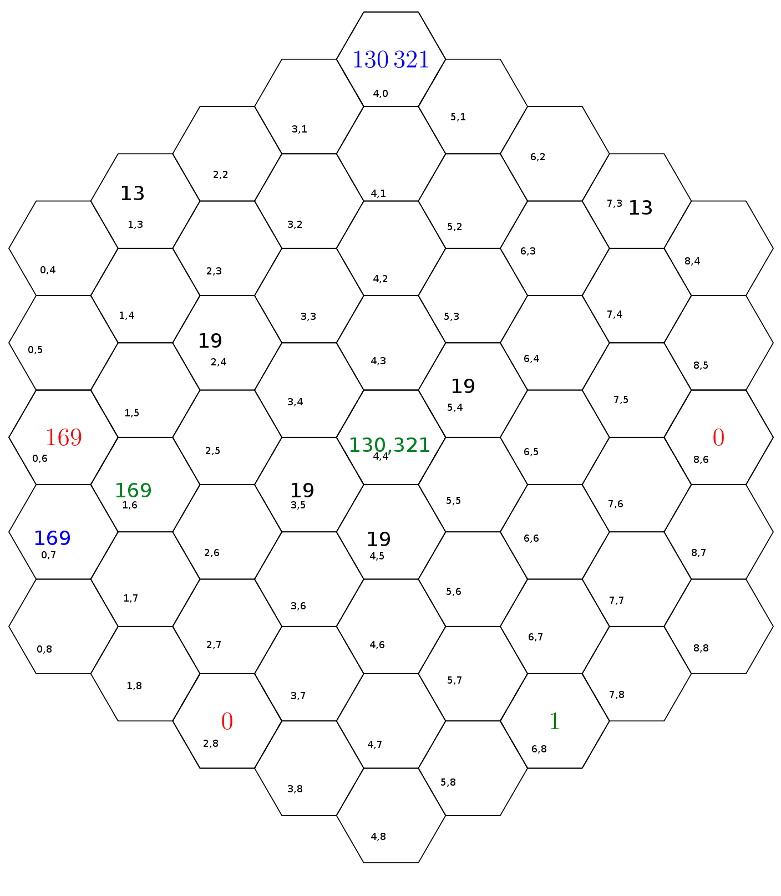
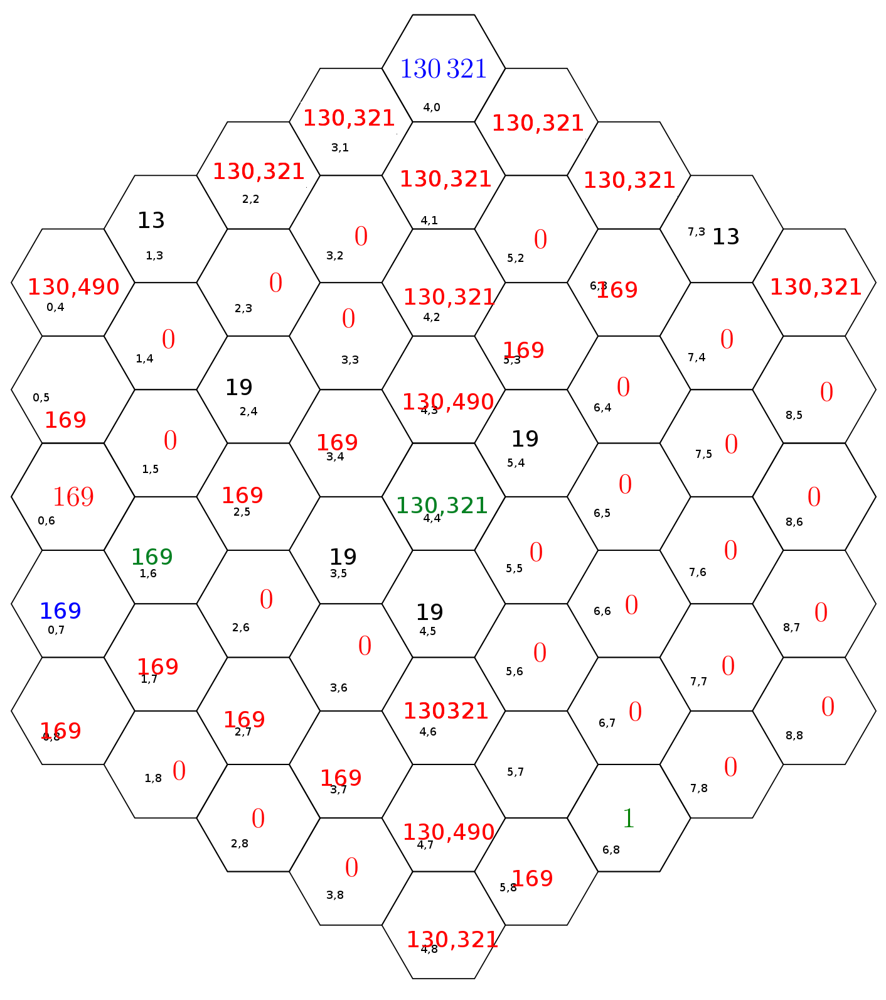

# Hex-Agony 2 Solver #

This is a short Perl program built to solve Jane Street's January 2017 puzzle, [Hex-agony #2](https://www.janestreet.com/puzzles/hex-agony-2/).

## Operating Assumptions
The script makes a number of assumptions about the solution, which seemed reasonable after fiddling with the problem by hand. These assumptions greatly reduced the search space, and so you may observe that the script finds the correct solution in ~1 second on ageing hardware.

1. There is a green 130,321 in the middle column
2. The red 169 has a blue 169 visible to it (implying that there are two black 13s whose product is 169)

## Program Specifics ##
 The Hex-agony puzzle is mapped to coordinates such that the bottom hex has row index 8:

## Constraints Solved, In Order
1. Green 130,321
    * Is in the middle column
2. Black 19s
    * Can see at least 19 "empty" spaces (which we later assume are red)
    * Can see green 130,321
    * Are four of these
3. Blue 169
    * Visible to red 169
    * Not visible to green 1
    * Not obstructing any of the black 19s from seeing >= 19 empty spaces
4. Green 169
    * Visible to blue 169
    * Not obstructing any of the black 19s from seeing >= 19 empty spaces
4. Black 13s
    * Not visible to green 130,321
    * Visible to green 169
    * Can see >= 13 empty spaces
    * Not obstructing any of the black 19s from seeing >= 19 empty spaces

## Solution
Solving these constraints results in this output from the Perl script:

And a bit of manual number crunching gives the final solution:

